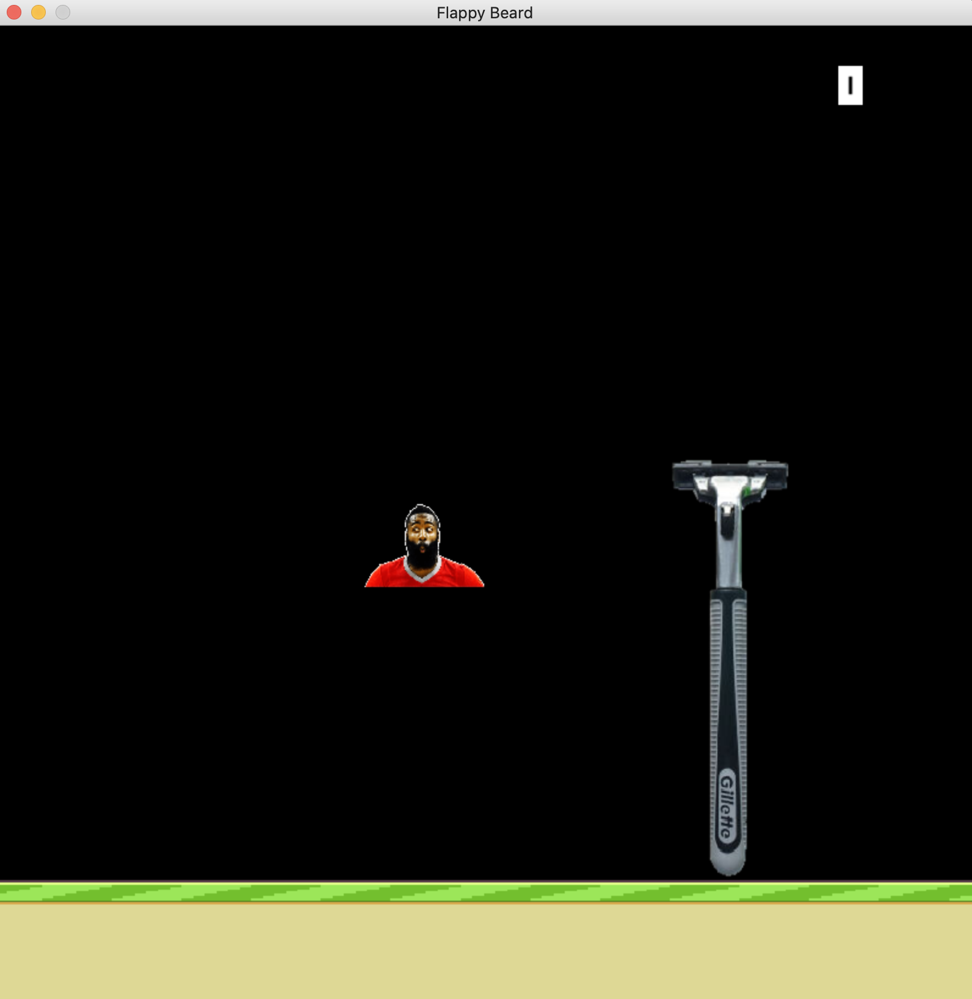

# Flappy Beard
An Arcade game made with python and pygame by controlling James Harden to avoid razors. If collision occurs with the razor, the game is over, James Harden face appears shaved and without a beard, final score is recorded, and you can press space to play again. 

Requires python3 and uses pygame 2.0.0.dev6 

After Running BeardRun.py, pygame console opens up: 

The main keyboard action is when pressing the up key and game ends when colliding with a razor, floor, or above the game screen. 
When collision occurs, press space to play again and high score will be recorded for playing session, however after closing the console
the high score is no longer recorded. 

Game over screen:

